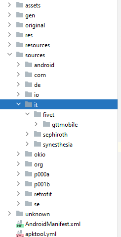

*data prima scrittura: 7/01/2021*

*data ultimo aggiornamento: 22/02/2021*

# Indice

* [Introduzione](#introduzione)
* [Analisi del traffico dati](#analisi-del-traffico-dati)
* [Decompilazione dell'app](#decompilazione)
* [Analisi del codice](#analisi-del-codice)
    * [La classe C1548a](#c1548a)
    * [La Classe ApiParameters](#apiparameters)
* [Recap / [TL; DR]](#tldr)

<br><br>

# Introduzione


In questa sezione racconterò ciò che ho scoperto durante Giugno 2019.

La versione dell'app che utilizzai è la **2.5.2** (ovvero l'ultima uscita finora xd).

---
**Ricordo che in seguito all'analisi di un'altra app per gli orari GTT (non ufficiale), ho scoperto dell'esistenza di un altro percorso dell'api non richiedente "l'autenticazione" mediante token e timestamp. Continua a leggere [qua](https://gtt.gabboxl.ga)**

---

Se dovessi trovare errori grammaticali o di qualsiasi tipo, sezioni poco chiare o con formattazioni poco coerenti, mi aiuteresti segnalandomelo con una issue su github! 

Grazie e buona lettura!

<br><br>


# Analisi del traffico dati

Inizialmente ho utilizzato un proxy HTTP, ricordo di aver scaricato una app chiamata Debug Proxy da internet per questo fine (anche se presenti alternative migliori), ma a quanto pare è attualmente stata rimossa per qualche strano motivo haha.

Sono riuscito ad intercettare le richieste inviate dalla app GTT al primo tentativo, l'app effettua chiamate HTTP di tipo GET e non fa utilizzo di alcun certificate pinning!

Ecco un esempio di chiamata http per le partenze ad una fermata:

----
img
-----


Insieme alla richiesta vengono aggiunti due parametri che determinano la validità della chiamata HTTP ai server di 5T: parlo degli header `TIMESTAMP` e `TOKEN`.
Infatti, *modificando e/o rimuovendo uno di essi (oppure entrambi), la richiesta viene rifiutata.*

L'header `TIMESTAMP` corrisponde esettamente al timestamp della richiesta effettuata, ma non riuscivo a capire la logica dietro alla creazione dell'header `TOKEN`.

Ho pensato inizialmente che i due header fossero legati fra di loro soltanto dal valore del timestamp, mi spiego meglio: ho intuito che l'header `TOKEN` fosse una sorta di *hash* generato dal valore del *timestamp* e da qualche altro dato di cui non ero a conoscenza.

------

Ho provato a ripetere la *stessa* chiamata allo *stesso* endpoint dell'api con gli *stessi* parametri (utilizzando Postman) e la richiesta andava a buon fine.

Da ciò ho capito che la richiesta veniva accettata anche se effettuata in un lasso di tempo diverso da quello definito dal *timestamp*.

 [**Spoiler**: dopo vai test scoprirò che dopo circa una decina di minuti la validità dei parametri diventa nulla e la richiesta viene nuovamente rifiutata]

-----

A questo punto ho provato ad compiere altre azioni nell'app per scoprire altri endpoint utilizzati.

Una volta trovati altri nodi da testare, ho creato una richiesta utilizzando come header i parametri della *primissima* prova che ho effettuato ma *non funzionavano*.

Da ciò ho dedotto che il valore del token creato fosse **strettamente legato al nodo della richiesta da effettuare** oltre che al timestamp.

-----

Per poter usufruire dell'api al di fuori dell'app, mi mancava capire come fosse generato il token.

<br><br><br>

<span id="decompilazione">
# Decompilazione dell'app

Ho estratto l'apk dell'app dal mio telefono tramite **adb** (Android Debug Bridge) che puoi scaricare [dal sito ufficiale](https://developer.android.com/studio/command-line/adb):

```bash
adb shell pm path it.fivet.gttmobile

adb pull <percorso all\'apk fornito dal comando precedente>
```

Dopodichè ho utilizzato **Jadx**  per decompilare il file apk. (Spesso utilizzo [javadecompilers.com/apk](http://javadecompilers.com/apk))

Il codice decompilato si trova nella cartella `sources`, mentre le risorse (immagini ecc.) sono dentro alla cartella `resources`.

<br><br><br>

# Analisi del codice

Ho iniziato cercando il codice della app in sé, scartando tutte le librerie:

Sono partito dal nome del pacchetto `it.fivet.gttmobile` e della Activity da avviare `it.fivet.gttmobile.activities.FirstLevelActivity` (puoi vederlo per esempio con LuckyPatcher oppure da adb). 


I nomi suggeriscono il percorso da seguire per arrivare al codice dell'Activity principale eseguita all'avvio dell'app.

---

La maggior parte del codice che gestisce la logica della app GTT è situato nella cartella `it` (`it` sta per il dominio di primo livello del nome delle librerie).

Nella suddetta cartella sono presenti altre tre cartelle: `fivet`, `sephiroth` e `synesthesia`.



-----
 
Da quello che ho scoperto cercando un po' su Google, Synesthesia è una "compagnia" italiana e torinese di "progettazione, UXD e sviluppo app, realizzazione eCommerce, siti web, eventi digitali, formazione e supporto start-up". Ma nell'omonima cartella non ho trovato codice legato in particolar modo alle richieste all'api.

Nella cartella `sephiroth` sembra essere presente una libreria proveniente dall'omonimo sviluppatore (svizzero (?)). (niente di importante anche qua)

Mentre nella cartella `fivet` è contenuto tutto il codice più importante riguardo le richieste http e generazione del token (spoiler: è scandalosa la logica impiegata).

Riguardo a "fivet" non ho trovato alcuna informazione su internet, se non il "Centro FIVET ASL di Torino", centri di medicina riproduttiva e procreazione assistita, e altre associazioni che *penso* abbiano poco a che fare con il prodotto in questione. 

Il dominio `fivet.it` porta in ogni caso al sito web di un'associazione dedicata a scopi sopracitati.


----


Comunque - torniamo al codice:

ho svolto la ricerca del codice per generare il token secondo questo ordine, partendo sostanzialmente dalla fine del processo:

**1)** Cercare il codice che crea ed invia la richiesta finale al server (la app usa Retrofit come libreria)

**2)** da quest'ultimo avrei individuato la variabile contenente il valore del token utilizzata come parametro header

**3)** seguire l'origine della variabile e capire il processo di creazione di essa (l'analisi del codice di Intellij semplifica estremamente il processo di ricerca degli utilizzi delle variabili, classi, funzioni ecc... basta un ctrl+click su di essa!)

<br>

Ho trovato il codice relativo alla "costruzione" della richiesta http da effettuare nel file `GttInterceptor.java` al seguente percorso: `sources/it/fivet/gttmobile/spice/retrofit/interceptors/GttInterceptor.java`:


<div>

<div style="display: inline-block;" markdown="1">

```java 
1
2
3
4
5
6
7
8
9
10
11
12
13
14
15
16
17
18
19
20
21
22
```

</div>


<div style="display: inline-block;" markdown="1">

```java 
package it.fivet.gttmobile.spice.retrofit.interceptors;

import android.util.Log;
import com.squareup.okhttp.Interceptor;
import com.squareup.okhttp.Interceptor.Chain;
import com.squareup.okhttp.Request;
import com.squareup.okhttp.Request.Builder;
import com.squareup.okhttp.Response;
import it.fivet.gttmobile.models.response.ApiParameters;
import it.fivet.gttmobile.p017e.C1548a;

public class GttInterceptor implements Interceptor {
    public Response intercept(Chain chain) {
        Request request = chain.request();
        ApiParameters a = C1548a.m1260a(request.urlString().replace("http://www.5t.torino.it/proxyws", ""));
        Builder newBuilder = request.newBuilder();
        newBuilder.addHeader("TOKEN", a.token);
        newBuilder.addHeader("TIMESTAMP", String.valueOf(a.timeStamp));
        Log.i("GttInterceptor", String.format("Sending request %s on %n%s", new Object[]{r1, newBuilder.build().headers()}));
        return chain.proceed(newBuilder.build());
    }
}
```
</div>

</div>

<br>

Prestate bene attenzione al codice.

Salta subito all'occhio la stringa `"http://www.5t.torino.it/proxyws"` - a quanto pare viene rimossa proprio questa parte di stringa con la funzione `.replace()` ad una stringa che *presumibilmente* contiene il **percorso dell'api** (ciò che viene sostituito con una stringa vuota `""`) **+** **percorso dell'endpoint**.


Quindi la variabile `request` contiene le informazioni sul dominio e percorso dell'endpoint. Con la funzione `.urlString()` infattti viene preso l'url intero della richiesta http da effettuare.


Concentriamoci sempre sulla riga **15**.

La variabile "**a**" è del tipo "**ApiParameters**" e ad essa è assegnat-

*SPe ma che sarebbe questo "ApiParameters"?*
*Alla riga 17 il token è preso dalla instanza della classe ApiParameters!!*
*E nella 18 ci sta anche il timestamp!1!!*

Oohhh calma, ci arriviamo! 


Dicevo, alla variabile "**a**" è essegnato un valore determinato da un metodo di nome **m1260a** appartenente ad una classe chiamata **C1548a**.

---

(**Ricorda**: Alcuni nomi di variabili/classi/funzioni potrebbero essere privi di senso in seguito alla decompilazione del codice offuscato come in questo caso. Potrebbero essere anche differenti da decompilazioni eseguite in tempi diversi;

Considerate tutto ciò che vedrete in questa pagina come "*pseudo codice*")

---

Seguiamo il percorso dell'import `it.fivet.gttmobile.p017e.C1548a;` (riga **10**) e vediamo cosa si cela all'interno di questa classe *misteriosa*:

<br>

<span id="c1548a">
## La classe C1548a (aka ApiUtilities) ((generazione del token))

<!-- <div style="-webkit-column-count: 2; -moz-column-count: 2; column-count: 2; -webkit-column-rule: 1px dotted #e0e0e0; -moz-column-rule: 1px dotted #e0e0e0; column-rule: 1px dotted #e0e0e0;  width: max-content;"> -->

<div>

<div style="display: inline-block;" markdown="1">

```java 
1
2
3
4
5
6
7
8
9
10
11
12
13
14
15
16
17
18
19
20
21
22
23
24
25
26
27
28
29
30
31
32
33
34
35
36
37
38
39
40
41
42
43
44
45
46
47
48
49
50
51
52
53
54
55
56
57
58
59
60
61
62
63
64
65
66
```

</div>


<div style="display: inline-block;" markdown="1">


```java
package it.fivet.gttmobile.p017e;

import android.content.Context;
import android.util.Log;
import io.fabric.sdk.android.services.common.CommonUtils;
import it.fivet.gttmobile.C1346b;
import it.fivet.gttmobile.GttApplication;
import it.fivet.gttmobile.models.response.ApiParameters;
import it.synesthesia.handroix.p026g.C1599a;
import java.io.IOException;
import java.io.InputStream;
import java.security.MessageDigest;
import java.security.NoSuchAlgorithmException;

/* compiled from: ApiUtilities */
/* renamed from: it.fivet.gttmobile.e.a */
public class C1548a {
    /* renamed from: a */
    public static ApiParameters m1260a(String str) {
        String str2 = "";
        Long valueOf = Long.valueOf(System.currentTimeMillis());
        if (C1346b.f501a.booleanValue()) {
            String toUpperCase = C1548a.m1261a(C1548a.m1262a(GttApplication.m431a(), "sale.png")).toUpperCase();
            str2 = C1599a.m1383b(str + String.valueOf(valueOf) + toUpperCase);
            Log.d("API_PARAMS", "apiName: " + str + " timeStamp: " + valueOf + " secret: " + toUpperCase);
            Log.d("API_PARAMS", "token: " + str2);
        }
        return ApiParameters.newInstance(str2, valueOf);
    }

    /* renamed from: a */
    public static byte[] m1262a(Context context, String str) {
        byte[] bArr = null;
        try {
            InputStream open = context.getAssets().open(str);
            bArr = new byte[open.available()];
            open.read(bArr);
            open.close();
            return bArr;
        } catch (IOException e) {
            return bArr;
        }
    }

    /* renamed from: a */
    public static String m1261a(byte[] bArr) {
        String str = CommonUtils.MD5_INSTANCE;
        try {
            MessageDigest instance = MessageDigest.getInstance(CommonUtils.MD5_INSTANCE);
            instance.update(bArr);
            byte[] digest = instance.digest();
            StringBuilder stringBuilder = new StringBuilder();
            for (byte b : digest) {
                str = Integer.toHexString(b & 255);
                while (str.length() < 2) {
                    str = "0" + str;
                }
                stringBuilder.append(str);
            }
            return stringBuilder.toString();
        } catch (NoSuchAlgorithmException e) {
            e.printStackTrace();
            return "";
        }
    }
}
```

</div>

</div>


---

Bene, attualmente ci troviamo al percorso `sources/it/fivet/gttmobile/p017e/C1548a.java`.

All'interno della classe **C1548a** sono presenti tre funzioni: la `m1260a` (riga 19), la `m1262a` (riga 32), e la `m1261a` (riga 46).

---

Direi di iniziare dalla funzione **m1260a**;
- nella variabile **valueOf** è contenuto il timestamp preso attraverso la funzione `System.currentTimeMillis()`.
- successivamente viene controllato che il valore di una variabile (contenuta in un'altra classe) sia `true` (a quanto pare è qualcosa legato alla connetività internet) [riga 22]:


---

Adesso inizia la parte bella - nella variabile **toUpperCase** [riga *23*] viene effettuata una chiamata al metodo **m1262a**.

Il metodo `m1262a` prende in input un "percorso" di un'immagine chiamata `sale.png`.

Cercando nella cartella delle *risorse dell'app*, l'immagine denominata `sale.png` corrisponde al logo dell'app:


Il compito della funzione **m1262a** è di aprire l'immagine dal percorso fornito sottoforma di *bytes*.

---

Tornando alla riga 22, l'immagine aperta sottoforma di byte è passata alla funzione **m1261a**.

Il metodo `m1261a` prende in input soltanto array di tipo *byte*.

Successivamente viene definita una variabile nominata `str` di tipo *String* - Essa corrisponde al valore di una costante chiamata `MD5_INSTANCE` contenuta nella classe `CommonUtils` dell'SDK *fabric*. **Questa costante ha come valore una stringa**: `"MD5"`.

In poche parole, il valore di `str` è una stringa con scritto `"MD5"`.

---

Dopo, viene creata una istanza di `MessageDigest` del modulo `security` di Java, indicando come paramentro la costante `"MD5"` dell'SDK frabric. (la variabile str a quanto pare viene dimenticata).

Vengono dati in *pasto* a `MessageDigest` i byte dell'immagine [riga 50] da cui viene fuori un hash **MD5** sottoforma di *array di byte* alla riga 51, il quale viene assegnato alla variabile nominata `digest`.

Dalla riga 53 alla 57 viene effettuara la conversione da *byte* a *String* dell'hash e viene salvata nella variabile `stringBuilder` ciclo dopo ciclo tramite la classe `StringBuilder`:


Alla fine viene della funzione `m1261a`, viene ritornato il valore dell'hash MD5 come *String*.

----

Ma non abbiamo ancora finito - ricordi quando avevo detto che il valore del token era strettamente legato all'endpoint dell'api scelto?

Bene, andiamo avanti:

alla riga  **24** entra in gioco una variabile di nome `str2`. Viene fatta una chiamata ad un metodo di nome `m1383b` appartenente ad una classe esterna di nome `C1599a`.


A questa funzione vengono passate come parametro la variabile `str`, variabile `valueOf`, e la variabile `toUpperCase`:

- la variabile `str`, se ricordi è il percorso dell'endpoint senza il dominio dell'api. (lo abbiamo visto nel file `GttInterceptor.java`);
- la variabile `valueOf` sarebbe il timestamp;
- mentre la variabile `toUpperCase` è l'hash MD5 del logo dell'app.

**Vediamo cosa c'è all'interno della classe C1599a:**

<div>

<div style="display: inline-block;" markdown="1">

```java 
1
2
3
4
5
6
7
8
9
10
11
12
13
14
15
16
17
18
19
20
21
22
23
24
25
26
27
28
29
30
31
32
33
34
35
36
37
38
39
40
41
42
43
44
45
46
47
48
49
50
51
52
53
54
55
56
57
```

</div>


<div style="display: inline-block;" markdown="1">

```java 
package it.synesthesia.handroix.p026g;

import android.content.Context;
import android.content.pm.PackageManager.NameNotFoundException;
import android.text.Html;
import io.fabric.sdk.android.services.common.CommonUtils;
import java.security.MessageDigest;
import java.security.NoSuchAlgorithmException;

/* compiled from: HdxUtility */
/* renamed from: it.synesthesia.handroix.g.a */
public class C1599a {
    /* renamed from: a */
    public static int f1155a = 2;
    /* renamed from: b */
    public static int f1156b = 1;
    /* renamed from: c */
    public static int f1157c = 0;

    /* renamed from: a */
    public static String m1381a(Context context) {
        String str = "";
        try {
            return context.getPackageManager().getPackageInfo(context.getPackageName(), 0).versionName;
        } catch (NameNotFoundException e) {
            e.printStackTrace();
            return str;
        }
    }

    /* renamed from: a */
    public static String m1382a(String str) {
        return Html.fromHtml(str).toString();
    }

    /* renamed from: b */
    public static String m1383b(String str) {
        String str2 = CommonUtils.MD5_INSTANCE;
        try {
            MessageDigest instance = MessageDigest.getInstance(CommonUtils.MD5_INSTANCE);
            instance.update(str.getBytes());
            byte[] digest = instance.digest();
            StringBuilder stringBuilder = new StringBuilder();
            for (byte b : digest) {
                str2 = Integer.toHexString(b & 255);
                while (str2.length() < 2) {
                    str2 = "0" + str2;
                }
                stringBuilder.append(str2);
            }
            return stringBuilder.toString();
        } catch (NoSuchAlgorithmException e) {
            e.printStackTrace();
            return "";
        }
    }
}
```
</div>

</div>

Eccola - 

ciò che ci interessa è soltanto la funzione **m1383b**.

Noti qualcosa di strano? - è esattamente identica alla **m1261a** della classe *C1548a*!

O meglio, *quasi uguale*... l'unica differenza sta nel tipo di parametro che accetta, ovvero solo *String* in questo caso.

---

QUINDI (tornando alla classe *C1548a*), dal percorso dell'endpoint senza il dominio dell'api **+** timestamp **+** hash MD5 del logo, **viene calcolato un nuovo hash MD5**.

I vari dati di output vengono loggati: 


(con un'app tipo [Logcat Reader](https://play.google.com/store/apps/details?id=com.dp.logcatapp&hl=it&gl=US) è possibile vederli)

---


Alla fine della funzione **ApiParameters m1260a**, vengono salvati i dati all'interno di un'instanza della classe ApiParameters... 

... e soltanto adesso posso rispondere alla domanda "*ma cos'è sta classe ApiParameters?*"!

<br>

<span id="apiparameters">
## La Classe ApiParameters

Nelle "importazioni" del codice è presente proprio la classe "ApiParameters" (`import it.fivet.gttmobile.models.response.ApiParameters;`). Andiamola a vedere al suo percorso corrispondente (`sources/it/fivet/gttmobile/models/response/ApiParameters.java`):


<div>

<div style="display: inline-block;" markdown="1">

```java 
1
2
3
4
5
6
7
8
9
10
11
12
13
14
15
16
```

</div>


<div style="display: inline-block;" markdown="1">

```java 
package it.fivet.gttmobile.models.response;

import java.io.Serializable;

public class ApiParameters implements Serializable {
    private static final long serialVersionUID = 1;
    public Long timeStamp;
    public String token;
 
    public static ApiParameters newInstance(String str, Long l) {
        ApiParameters apiParameters = new ApiParameters();
        apiParameters.token = str;
        apiParameters.timeStamp = l;
        return apiParameters;
    }
}
```
</div>

</div>

La classe **ApiParameters** funge da "contenitore" per le variabili "**timeStamp**" e "**token**".

La classe contiene inoltre una funzione chiamata "**newInstance**" che prende come parametri una stringa `str` e un *Long* (intero a 64 bit) `l`.
Successivamente questa funzione va ad assegnare alle variabili interne della classe i dati che ha preso come parametri.

La funzione **ritorna un'instanza di ApiParameters**.

---

Oltre alla classe `ApiParameters` è possibile notare che nella cartella "response" (come può suggerire il nome della cartella a cui è sottostante - "models") sono presenti classi dedicate a contenere informazioni per ogni genere di dato preso dall'api. (I nomi di esse suggeriscono il genere di dati che contengono)


<br><br><br>


<span id="tldr">
# Recap (TL; DR)
